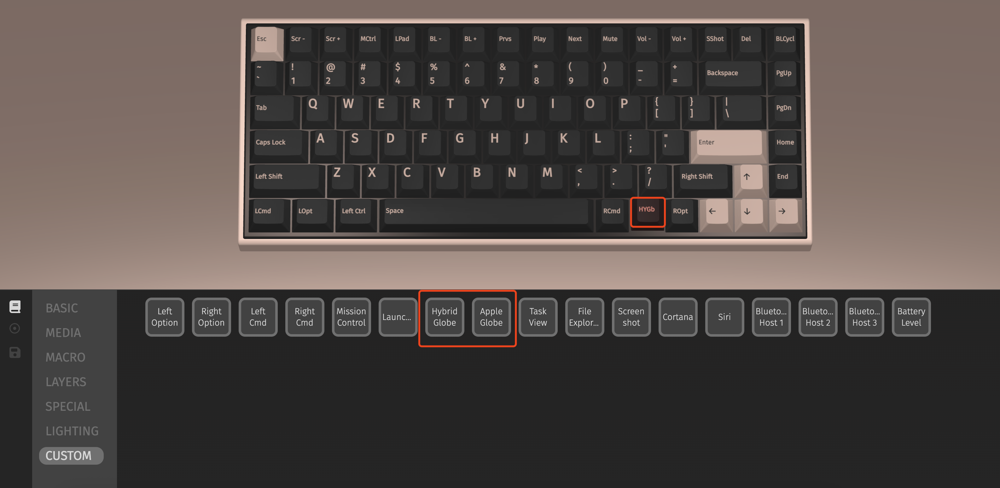

# QMK for Candysign Keyboard Pro (Keychron K2 Pro)

This is a personal build for Candysign Keyboard Pro, which is a variant of Keychron K2 Pro.

## Globe(fn) Supports on macOS

Support Globe(fn) key on macOS. Works under Mac mode by default. 

There are 2 definitions you can find in VIA:



- Hybrid Globe (Default)

    It simulates how *LT(1,Globe)* works, which it not supported by QMK.
    
    This key definition can only be used to switch IME. Hold it and switch to layer 1, which is same as the original firmware.

- Apple Globe
    
    It simulates how Globe key works on Apple's keyboard, but F-Keys(F1~F12) and keys defined in layer 1 will not work. Choose if you want to use system key combinations.
    
## Build Destinations

### For Keychron K2 Pro

If you are using Keychron K2 Pro:

``` bash
make keychron/k2_pro/ansi/white:via:flash  
```

### For Candysign Keyboard Pro (硬糖机械键盘Pro)

If you are using Candysign Keyboard Pro (硬糖机械键盘Pro) from Candysign (制糖工厂):

``` bash
make keychron/k2_pro/ansi/white:candysign:flash  
```
